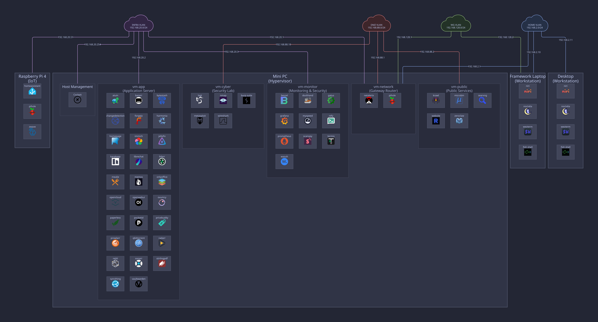

# NixOS Configuration

**Welcome to the future of homelabbing.**

This repository is a **fully declarative, reproducible infrastructure** definition for my personal homelab. Built on **NixOS** and **Nix Flakes**, it represents a complete paradigm shift from fragile, imperative administration to a robust, code-driven ecosystem. Every layer — from CPU/RAM allocation, disk partitioning, VLAN assignment, to application services, container orchestration, and secret management — is defined in code. Version controlled and GitOps-friendly, it emphasizes **stability** through atomic rollbacks, **observability** via a comprehensive monitoring stack, and **security** with hardened services and isolated networking.

The hardware? A mini PC, a Raspberry Pi, an unmanaged switch, and some old hard drives. No enterprise racks. No excessive power draw. The goal is **maximum software efficiency** — proving that proper architecture, deliberate design, and disciplined engineering matter far more than raw specs. This setup runs a full production-grade stack: [virtual machine orchestration](./modules/services/infra/hypervisor/default.nix), [IPv4/IPv6 dual-stack VLAN-segmented networking](./modules/services/networking/router/default.nix), [VPN for remote access](./modules/services/networking/wireguard/server.nix), [high-availability DNS cluster](./modules/services/networking/dns/default.nix), [centralized logging and monitoring](./modules/services/observability/), [encrypted local and offsite backups](./modules/services/infra/restic/default.nix), [private code repositories with CI/CD pipelines](./modules/services/apps/development/forgejo/default.nix), [local binary cache](./modules/services/infra/harmonia/default.nix), [reverse proxies with automatic TLS](./modules/services/networking/nginx/default.nix), [SIEM platform](./modules/services/security/wazuh/server.nix), media servers, document management, smart home automation, and more.

The beauty of this setup? **Total vertical alignment.** The entire infrastructure is declared in one monolithic Nix flake and accessible to all hosts. Change a VM's VLAN assignment? Update one value in Nix, rebuild, and the entire networking stack reconfigures. Need to migrate a service between hosts? Move the configuration block and redeploy — the entire dependency chain follows atomically.

**100% declarative. 100% visible. 100% reproducible.** No hidden state. No XML sprawl. No clicking through web UIs. Just plain-text Nix code. This is true infrastructure-as-code: reproducible, auditable, and resilient.

## Project Structure

**Architected for Evolution. Built for Scale.**

This infrastructure is engineered following a rigorous **Domain-Driven Design** philosophy. The modules are organized into four distinct, composable layers:

1. **core ([`modules/core`](./modules/core)):** The foundational DNA. Universal baselines shared across all systems, defining the essential "NixOS-ness" of the fleet.
2. **platform ([`modules/platforms`](./modules/platforms)):** The hardware abstraction layer. Whether it's a Raspberry Pi ARM chip or a virtualized x86 hypervisor, this layer handles the metal. Disk partitioning is fully declarative using **Disko**, defining GPT layouts, LVM volume groups for guest VM disks, and filesystem mounts.
3. **roles ([`modules/roles`](./modules/roles)):** The personality injection. A host is defined by its mission: a hardened **Headless Server** guarding the network, or a feature-rich **Workstation** designed for development.
4. **services ([`modules/services`](./modules/services)):** The functional payload. Granular, plug-and-play applications categorized by domain:
   - [**infra**](./modules/services/infra): The backbone utilities (binary cache, hypervisor, backup).
   - [**networking**](./modules/services/networking): The mesh that connects it all (DNS, routing, VPN).
   - [**observability**](./modules/services/observability): The eyes and ears (monitoring, logging, tracking agents).
   - [**security**](./modules/services/security): The active defense perimeter (Fail2Ban, Wazuh, Suricata, CrowdSec).
   - [**apps**](./modules/services/apps): The user experience, grouped by function (office, tools, media, authentication, development).

## Network Architecture

### Logical Topology

```ascii
                  +--------------+        +-----------------+        +--------------------+
                  | The Internet |        | Cloudflare Edge |        | Remote VPN Clients |
                  +--------------+        +-----------------+        +--------------------+
                         ^                         |                           |
                         |                         |                           |
                       (WAN)              (Cloudflare Tunnel)          (WireGuard Tunnel)
                         |                         |                           |
                         |                         v                           v
+-------------------------------------------------------------------------------------------------------+
| [vm-network] (libvirt VM)                                                                             |
| 4 vCPU, 2GB RAM, NIC Passthru                                                                         |
| Role: Router, Firewall (nftables), DHCP (Kea), DNS master (Pi-hole/Unbound), VPN Gateway (WireGuard)  |
+-------------------------------------------------------------------------------------------------------+
                                                   ^
                                                   |
                                              (LAN Trunk)
                                                   |
             +-------------------------------------|-------------------------------------+
             |                                     |                                     |
             v                                     v                                     v
+-------------------------+    +-------------------------------------+    +-----------------------------+
| LAN (Native/Untagged)   |    | VLAN 20 (Infra)                     |    | VLAN 88 (DMZ)               |
| Network: 192.168.2.0/24 |    | Network: 192.168.20.0/24            |    | Network: 192.168.88.0/24    |
| Desc: Trusted Clients   |    | Desc: Servers & Infrastructure      |    | Desc: Untrusted Workloads   |
+-------------------------+    +-------------------------------------+    +-----------------------------+
| +---------------------+ |    | +---------------------------------+ |    | +-------------------------+ |
| | [desktop]           | |    | | [hypervisor] (libvirt host)     | |    | | [vm-public] (libvirt VM)| |
| | AMD 3600, 32GB RAM  | |    | | AMD 6900HX, 32GB RAM            | |    | | 4 vCPU, 2GB RAM         | |
| | AMD Radeon RX 570   | |    | | Hosts: All virtual machines     | |    | | Hosts: Public endpoints | |
| +---------------------+ |    | +---------------------------------+ |    | +-------------------------+ |
| +---------------------+ |    | +---------------------------------+ |    | +-------------------------+ |
| | [framework]         | |    | | [vm-app] (libvirt VM)           | |    | | [vm-cyber] (libvirt VM) | |
| | AMD 7640U, 32GB RAM | |    | | 10 vCPU, 12GB RAM, GPU Passthru | |    | | 4 vCPU, 4GB RAM         | |
| +---------------------+ |    | | Hosts: Jellyfin, Immich, etc    | |    | | Role: Security Research | |
| (Other clients...)      |    | +---------------------------------+ |    | +-------------------------+ |
|                         |    | +---------------------------------+ |    |                             |
|                         |    | | [vm-monitor] (libvirt VM)       | |    |                             |
|                         |    | | 4 vCPU, 4GB RAM                 | |    |                             |
|                         |    | | Hosts: Prometheus, Wazuh, etc   | |    |                             |
|                         |    | +---------------------------------+ |    |                             |
|                         |    | +---------------------------------+ |    |                             |
|                         |    | | [pi] (Raspberry Pi 4)           | |    |                             |
|                         |    | | Hosts: Home Assistant, DNS slave| |    |                             |
|                         |    | +---------------------------------+ |    |                             |
|                         |    | DNS VIP: 192.168.20.53 (HA Cluster) |    |                             |
+-------------------------+    +-------------------------------------+    +-----------------------------+
             |                                     ^                                     ^
             |                                     |                                     |
             +-------------------------------------|-------------------------------------+
```

### Visual Topology



### The Cybernetic Nexus

The `vm-network` VM serves as the nerve center of the home network. It replaces consumer-grade router firmware with a fully software-defined, hardened networking appliance that routes every packet, enforces strict firewall rules, and inspects traffic for threats.

### Routing Foundation

The network is physically connected via two interfaces, but logically segmented into distinct security zones using VLANs and virtual interfaces:

- **WAN:** The shield against the public internet.
- **LAN:** The physical trunk carrying multiple logical networks:
  - **Home/Native (VLAN 2):** Trusted user devices (e.g., `desktop`, `framework`).
    - _Routing:_ Unrestricted access to WAN, Infra, DMZ, and VPN.
  - **Infra (VLAN 20):** Dedicated management lane for servers and critical infrastructure (e.g., `pi`, `vm-app`, `vm-monitor`).
    - _Routing:_ Access to WAN. Isolated from Home.
  - **DMZ (VLAN 88):** Isolated zone for untrusted workloads (e.g., `vm-cyber`).
    - _Routing:_ Access to WAN. Restricted access to Infra for DNS (UDP/TCP 53) only. No access to Home.
- **WireGuard (VLAN 128):** Secure remote access tunnel.
  - _Routing:_ Authenticated peers get full access to Home, Infra, and DMZ networks.

### Dual-Stack IPv4/IPv6 Routing

The homelab runs a dual-stack IPv4/IPv6 network managed by the `vm-network` router:

- **IPv4 Allocation**: Managed by **Kea DHCPv4**, providing separate pools and subnets for each VLAN security zone.
- **IPv6 Autoconfiguration**: Handled via stateless **SLAAC** and the **Router Advertisement Daemon (radvd)**, distributing static Unique Local Addresses (ULA) per VLAN, dynamic global prefixes from the WAN, and configuring the high-availability DNS cluster Virtual IP via RDNSS.

### High-Availability DNS

The network relies on a high-availability DNS cluster between `vm-network` and `pi` to ensure that ad-blocking and name resolution never sleep.

- **The Stack:** **Pi-hole** for network-wide ad-blocking + **Unbound** for recursive, privacy-respecting DNS-over-TLS resolution.
- **The Redundancy:** **Keepalived** manages a Virtual IP (VIP) that floats across the cluster. If the master node blinks, the VIP instantly migrates to a backup, keeping the network online without a hiccup.

### External Access

To maintain a zero-exposure posture, all external access is brokered by **Cloudflare Tunnels**. This architecture ensures that no ports are open on the WAN interface (besides WireGuard), completely eliminating the need for traditional port forwarding. The `cloudflared` service (running on `vm-network`) establishes an encrypted outbound connection to the Cloudflare edge, securely routing traffic for public-facing subdomains directly to the internal application stack. Only services hosted in the DMZ (VLAN 88) are exposed to the internet — the Infra and Home networks remain completely isolated from external access.

Furthermore, all web-facing services are placed behind an **Nginx reverse proxy**, which acts as a unified gateway. SSL/TLS certificates are automatically provisioned and managed by **ACME (Let's Encrypt)**, leveraging Cloudflare for DNS challenges, ensuring robust, always-on encryption without manual intervention.

## The Fleet

This infrastructure comprises 9 distinct hosts. Here's the breakdown:

### [`desktop`](./hosts/desktop.nix)

- **The Command Center.** The primary high-performance development workstation, acting as the main anchor for local coding and daily work.
- **Hardware**: AMD 3600, 32GB RAM, AMD Radeon RX 570
- **Network:** Home (Native)

### [`framework`](./hosts/framework.nix)

- **The Mobile Outpost.** A portable laptop configured for on-the-go development, remote operations, and on-site troubleshooting.
- **Hardware**: AMD 7640U, 32GB RAM
- **Network:** Home (Native), WireGuard (VLAN 128)

### [`pi`](./hosts/pi.nix)

- **The Physical Bridge.** Armed with **Z-Wave** and **Zigbee** radios, acting as the smart hub running Home Assistant while standing watch as a backup DNS node.
- **Hardware**: Raspberry Pi 4 with 2GB RAM
- **Network:** Infra (VLAN 20)

### [`hypervisor`](./hosts/hypervisor.nix)

- **The Bedrock.** This mini PC runs **NixOS with libvirt** as a headless hypervisor host. It spawns and manages four virtual machines (`vm-network`, `vm-app`, `vm-monitor`, `vm-cyber`), powered by the NixVirt module. The entire virtualization stack — from VLAN-filtered bridges to PCI passthrough to VM lifecycle management — is defined declaratively.
- **Hardware**: AMD 6900HX, 32GB RAM
- **Network:** Infra (VLAN 20)

### [`vm-network`](./hosts/vm-network.nix)

- **The Sentinel.** The primary router, firewall, and DNS authority. It manages the Cloudflare Tunnels, WireGuard VPNs, and Suricata IDS/IPS. A physical NIC is passed through from the hypervisor to serve as the WAN interface, providing direct hardware access for maximum throughput and security.
- **Hardware**: 4 vCPU cores, 2GB RAM, NIC passthrough (WAN)
- **Network:** Gateway (WAN, Home, Infra, DMZ)

### [`vm-app`](./hosts/vm-app.nix)

- **The Powerhouse.** The main application server. GPU passthrough enables hardware-accelerated transcoding for Jellyfin. It runs my complete suite of user-facing services: Immich for photos, Paperless-ngx for documents, Forgejo for code, and more.
- **Hardware**: 10 vCPU cores, 12GB RAM, GPU passthrough
- **Network:** Infra (VLAN 20)

### [`vm-monitor`](./hosts/vm-monitor.nix)

- **The Watchtower.** Dedicated to keeping the lights on. It hosts the **Beszel Hub**, **Prometheus**, **Loki**, **Wazuh Server**, and **Gatus** to visualize the health and security of the entire infrastructure.
- **Hardware**: 4 vCPU cores, 4GB RAM
- **Network:** Infra (VLAN 20)

### [`vm-public`](./hosts/vm-public.nix)

- **The Public Face.** A DMZ-hosted server exposing personal projects and services to the world.
- **Hardware**: 4 vCPU cores, 2GB RAM
- **Network:** DMZ (VLAN 88)

### [`vm-cyber`](./hosts/vm-cyber.nix)

- **The Armory.** A specialized, security-focused desktop environment loaded with tools for penetration testing, forensics, and reverse engineering.
- **Hardware**: 4 vCPU cores, 4GB RAM
- **Network:** DMZ (VLAN 88)
- **Security:** **None.** This host is intentionally left vulnerable with no defenses to ensure maximum attack efficiency and unrestricted tool usage.

### Shared Services

Every server host (`pi`, `vm-network`, `vm-app`, `vm-monitor`) comes equipped with a standard observability and security sidecar:

- **Prometheus Exporters:** Granular telemetry for Nginx, Node, Podman, etc.
- **Alloy:** Grafana Loki agent for collecting `systemd-journal` logs.
- **Beszel Agent:** Custom monitoring agent for real-time insights and control.
- **Dockhand Agent (Hawser):** Lightweight container agent for OCI container monitoring and management.
- **Wazuh Agent:** Enterprise-grade security monitoring and intrusion detection.

## Secret Management

**Vault-Grade Secrets.**

No more `.env` files leaking in git history. Sensitive data is encrypted at rest using **agenix**. Secrets are decrypted only at runtime, in-memory, and only by the specific host identity that requires them. It is cryptographically secure and zero-trust by default.

## Operations & Maintenance

**Atomic. Reproducible. Resilient.**

The operational layer transforms manual sysadmin workflows into deterministic, code-driven automation. Every deployment is atomic, every rollback is instantaneous, and data is continuously protected.

### Declarative VM Orchestration (`nixos-vm-provisioner`)

Standard virtualization tools assume you want to manage VMs imperatively, clicking through UIs or running manual command-line sequences. To bridge the gap between static Nix declarations and live stateful VMs, the hypervisor runs [nixos-vm-provisioner](https://github.com/ruiiiijiiiiang/nixos-vm-provisioner) — a fully custom-built, zero-intervention NixOS module.

Instead of manual disk preparation and interactive guest configurations, the provisioner acts as the host's control plane. It dynamically orchestrates the host's physical storage (carving out thin-provisioned LVM volumes on the fly) and compiles centralized hardware constants — vCPU allocations, RAM limits, MAC addresses, and passthrough PCIe devices — directly into running NixVirt/QEMU guest domain configurations. One configuration file. Zero manual setups. Complete host-to-guest alignment.

### Binary Cache & Pre-Built Artifacts

A private **Harmonia** binary cache runs on `vm-app`, serving as the fleet's internal package repository. A nightly job pre-builds all host configurations and populates the cache with compiled derivations. Deployments pull pre-built packages directly from the local network instead of rebuilding from source or downloading from public caches. This eliminates compilation overhead and guarantees consistent deployment artifacts across the infrastructure.

### Deployment Workflows

**Dual-Pipeline Architecture.**

The infrastructure employs a dual CI/CD strategy, enabling both local-first and remote fallback deployments:

- **Local Pipeline (Forgejo):** Executes directly on `vm-app` with native Podman socket access. Deploys to all virtual machines over SSH via the Infra VLAN. Rebuilds and activates NixOS configurations atomically. Zero overhead. Maximum performance.
- **Remote Pipeline (GitHub Actions):** Establishes a WireGuard tunnel into the homelab for external access. Deploys to all hosts including `pi` using ARM-native runners. Accessible from anywhere. Environment independence.

The local Forgejo instance doubles as a private **OCI container registry**. CI pipelines build, push, and version container images for personal projects, creating a self-contained artifact ecosystem consumed across the entire infrastructure.
